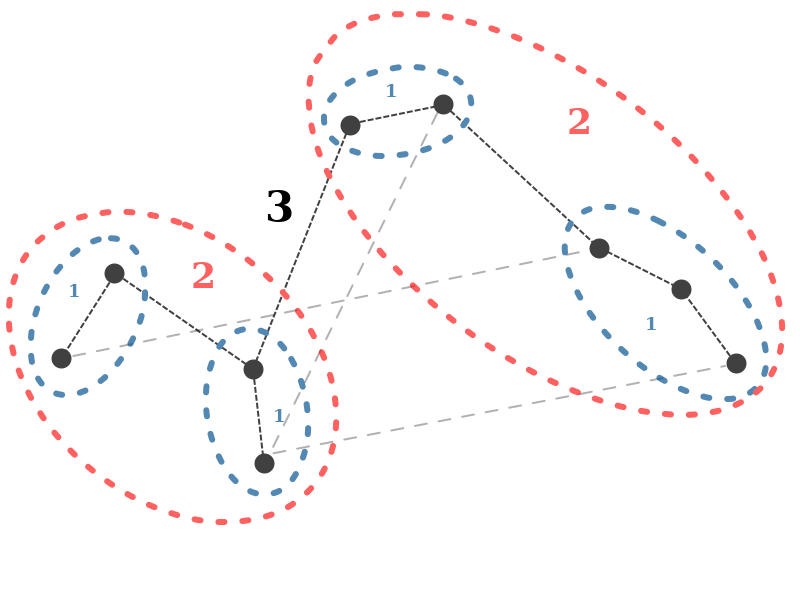

MST
=====

.. autoclass:: pankus.taurus.MST

About MST
----------

Minimum Spanning Tree (MST) graph connects points in the network using connection weight cryteria. Every point binds with the closest one, meaning the one with minimum connection weight parameter value. That way groups of 2 or more points are created, which later serve as new "points". Groups connect with other groups on the same basis until there can be no more groups connected.

See also: `Wikipedia`_

.. _Wikipedia: https://en.wikipedia.org/wiki/Bor%C5%AFvka%27s_algorithm 

Functions
-----------
.. toctree::
   :maxdepth: 1
   :glob:

   ../mst/*

