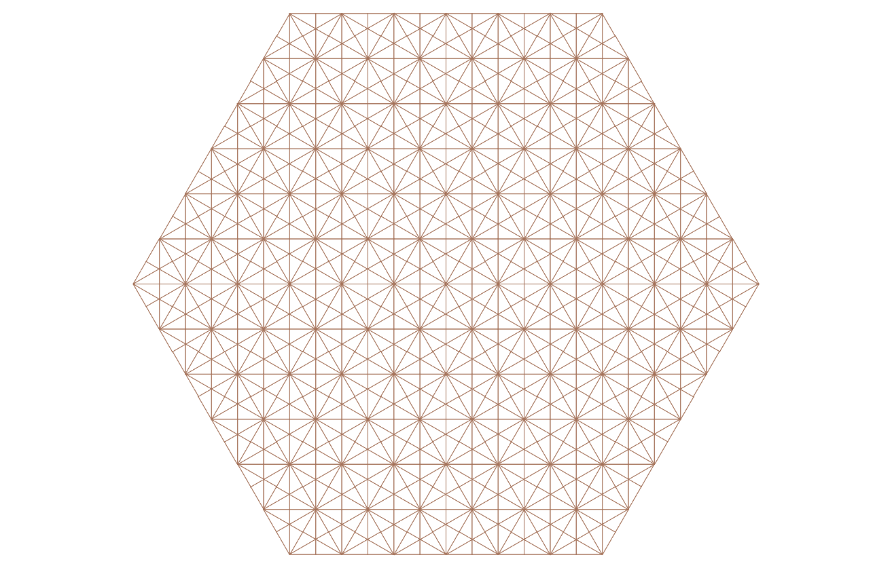

make_hexdiagonal_pattern_network
==================================

.. autofunction:: pankus.taurus.NetworkGenerator.make_hexdiagonal_pattern_network

Data used
----------

.. toctree::
  :maxdepth: 1
  :caption: Tables:

  ../tables/network_geometry
  ../tables/network_properties
  ../tables/od_geometry
  ../tables/od_properties

Effect
------
- A network in a shape of hexagon is created
- Newly created network has specific properties
- All of network data is written into :ref:`network_properties_table` and :ref:`network_geometry_table` tables

Network shape
--------------

Shape of network generated by executing function 

.. code-block:: python
   
   make_hexdiagonal_pattern_network(6)

